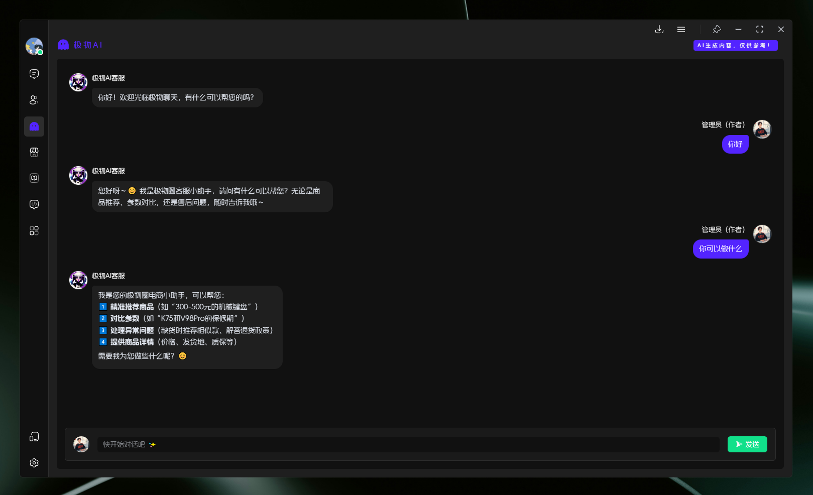
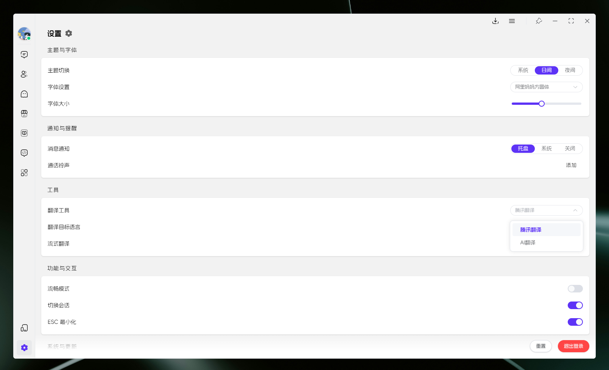

<div align=center>
 <div align=center margin="10em" style="margin:4em 0 0 0;font-size: 30px;letter-spacing:0.3em;">

 </div>
 <h2 align=center style="margin: 2em 0;">JiwuChat Tauri APP</h2>

<div>
      <a href="https://github.com/Kiwi233333/jiwu-mall-chat-tauri" target="_blank">
        
      </a>
      <a href="https://github.com/Kiwi233333/jiwu-mall-chat-tauri/stargazers" target="_blank">
        
      </a>
    </div>
    <div>
      <a href="https://github.com/Kiwi233333/jiwu-mall-chat-tauri/commits" target="_blank">
        
      </a>
      <a href="https://github.com/Kiwi233333/jiwu-mall-chat-tauri/issues" target="_blank">
        
      </a>
    </div>
    <div>
      <a href="`https://github.com/Kiwi233333/jiwu-mall-chat-tauri/blob/main/LICENSE`" target="_blank">
          
      </a>
      <a href="https://app.netlify.com/sites/jiwuchat/deploys" target="_blank">
          
      </a>
      <a href="https://qm.qq.com/q/iSaETNVdKw" target="_blank">
        
      </a>
    </div>
    <div>
      <a href="https://www.deepseek.com/" target="_blank" style="margin: 2px;">
        
      </a>
    </div>

Official Website: [JiwuChat](https://jiwuchat.kiwi233.top/)
<br>
Language : [简体中文](./README.md) | English

</div>

## Introduction

JiwuChat is a lightweight `(~10MB)` multi-platform chat application built with Tauri2 and Nuxt3. It supports various real-time messaging features, AI group chat bots (integrated with `iFlytek Spark`, `KimiAI`, etc.), `WebRTC audio/video calls`, screen sharing, and AI-powered shopping. It enables seamless cross-device communication, supporting text, images, files, and voice messages, along with group chats and customizable settings. Light/dark mode is available for efficient social networking. ✨

## One Codebase, Multiple Platforms


## Default Account

- Username: ikun233  
- Password: 123456  
- Demo: [Web Version](https://chat.jiwu.kiwi233.top/)  

> ⚠ Note: ~~This test account has limited permissions (e.g., no file uploads, profile edits, or password changes).~~  

> 👀 Thanks for your support! The project is still under development, and the backend is not yet open-source. Feel free to share your feedback via email or QQ.  

## Feature List  

| Module         | Description                                                                 | Status |
|----------------|-----------------------------------------------------------------------------|--------|
| User Module    | Supports login/registration via account, phone, or email; profile management | ✔      |
| Messaging      | Supports text, images, files, voice, @mentions, recall, delete, and AI replies | ✔      |
| Chat Sessions  | Group chats, private chats, pinning, roles (owner, admin, etc.)              | ✔      |
| Contacts       | View, add, and delete contacts                                              | ✔      |
| System Updates | Auto-updates, version announcements                                         | ✔      |
| Account Security| Login, password change, device security, online status management           | ✔      |
| AI Module      | Supports multiple AI chatbots (e.g., `DeepSeek`, `iFlytek Spark`, `KimiAI`) | ✔      |
| Smart Shopping | AI-powered product recommendations via `Jiwu Circle`                       | ✔      |
| File Management| Download, open, and delete files locally                                   | ✔      |
| Audio/Video    | `WebRTC`-based screen sharing, voice, and video calls                       | ✔      |
| Others         | AI translation, dark/light mode, fonts, custom download paths, multi-OS support | ✔      |

## Screenshots  

- Desktop App: Login / Register  

  

  

- Light / Dark Themes  

  

  

- AI Chatbots (DeepSeek, iFlytek Spark, Kimi AI) 🤩  

  

  

  

- Audio/Video Calls (WebRTC)  

  

- Screen Sharing  

  

- Social Chat  

  

- AI Shopping (Powered by [Jiwu Circle](https://github.com/KiWi233333/jiwu-mall-sites))  

  

  

- Account & Security  

  

  

- Settings  

  

- Mobile Adaptation  

<div>
 
 
 
 
 
 
 
 
 
 
 
 
 
</div>  

## ⏳ Getting Started  

### 📦 Install Dependencies  

```sh
Node.js >= 18 required
npm install -g pnpm

pnpm install
```  

### ✨ Development  

- 📌 If you **don't** have a backend server, modify `.env.development` or use `.env.production`.  

```sh
Terminal 1: Start Nuxt (Production)
pnpm run prod:nuxt
Terminal 2: Start Tauri
pnpm run dev:tauri
```  

- If you **have** a backend, customize `.env.development` for development:  

```sh
Recommended to run separately
Terminal 1: Start Nuxt
pnpm run dev:nuxt
Terminal 2: Start Tauri
pnpm run dev:tauri
```  

### 📦 Build  

```sh
pnpm run build:tauri
```  

### ❌ pnpm Install Errors  

Check registry:  

```sh
pnpm get registry
```  

Temporary fix:  

```sh
pnpm --registry https://registry.npm.taobao.org install any-touch
```  

Persistent change:  

```sh
pnpm config set registry https://registry.npm.taobao.org
```  

Revert:  

```sh
pnpm config set registry https://registry.npmjs.org
```  

## 🔧 Tech Stack  

| Category       | Technology/Component       | Version       |
|----------------|----------------------------|---------------|
| Framework      | Nuxt                       | ^3.14.159+    |
|                | Tauri                      | ^2.1.0        |
| UI Library     | Element Plus               | ^2.8.4        |
| State Management| Pinia                      | 2.1.7         |
| Utility        | Vueuse                     | 10.11.0       |
| Build Tools    | Nuxi                       | lts           |
|                | Vite                       | lts           |
| Code Quality   | ESLint                     | 8.56.0        |
|                | Prettier                   | 3.3.2         |
| Type Checking  | TypeScript                 | 5.3.2         |
| Styling        | Sass                       | 1.77.6        |  

## 🦾 Trends  


## 💬 Contact  

- Email: [kiwi2333@qq.com](mailto:kiwi2333@qq.com)  
- QQ: [1329634286](https://wpa.qq.com/msgrd?v=3&uin=1329634286&site=qqq&menu=yes)  
- QQ Group: [939204073](https://qm.qq.com/q/iSaETNVdKw)  
